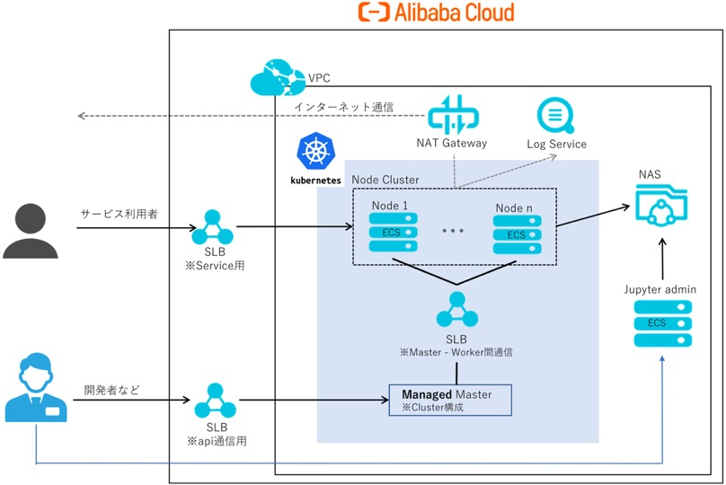
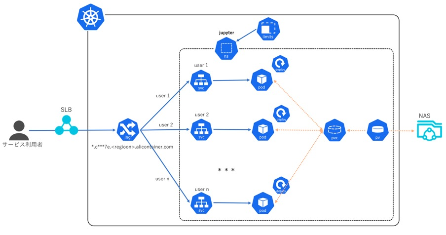

# jupyter_notebook_on_k8s

## The Alibaba Cloud Infrastrucutre of Jupyter Notebook


## Jupyter on ACK


## 構築手順

前提条件: Alibaba Cloud Python SDK / Aliyuncli が利用できる環境が必要 

[ 1 ]  
1_infra.pyを参考に、jupyterのAliCloud Infra環境( VPC, NAS, RAM, ACK Cluster など )を作成

[ 2 ]  
ACKのclusterのconfigを取得し、ローカル環境の `.kube/config` に設定

[ 3 ]  
K8sに Jupyterのnamespace `jupyter` を作成
  
```shell
kubectl create namespace jupyter
``` 

[ 4 ]  
ディレクトリの 2_k8s 配下に移動

[ 5 ]  
`1_jupyter-nas.yaml` に NASの MountPointなどを設定し、NASのPV, PVCを作成
```shell
kubectl apply -f 1_jupyter-nas.yaml -n jupyter
``` 

[ 6 ]  
変数 `domain` に 作成したK8s Cluster domain を設定し、`2_kubeclt_apply.sh` で jupyter環境を作成  
※ 初回目作成の時に jupyter imageを取得する必要があるため、3 ~ 5分時間がかかる

```shell

domain="*******.ap-northeast-1.alicontainer.com"

./kubectl_apply.sh <The num of user> ${domain}

``` 

[ 7 ]
表示された各User の Token を利用して, http:// < user > .${domain} にアクセス


